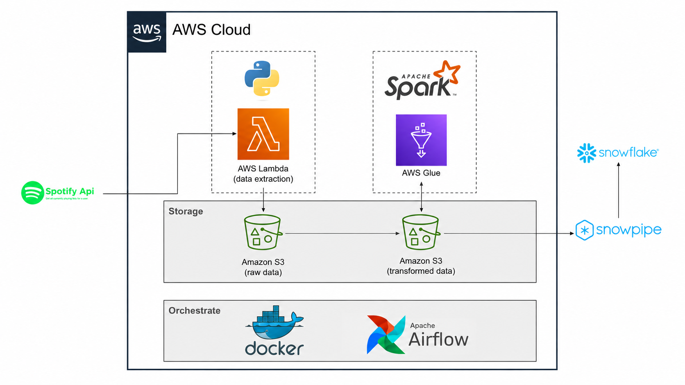
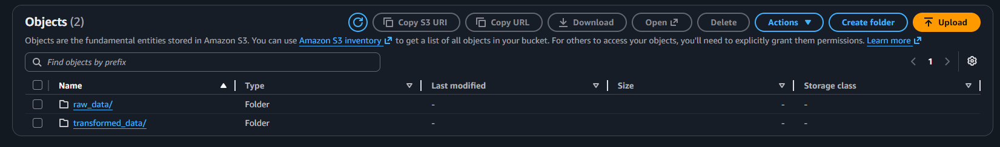
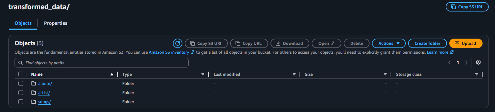
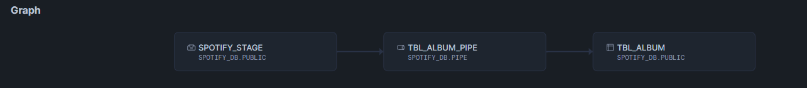
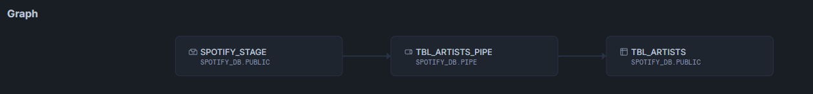
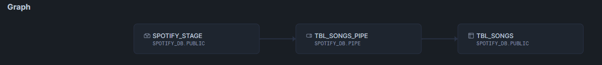
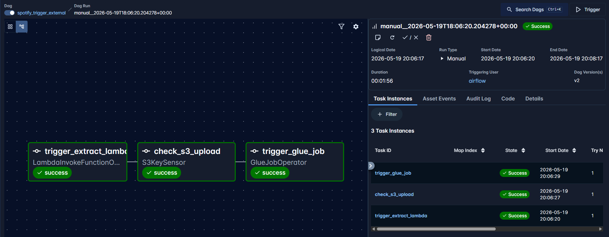

# Spotify Data Pipeline (AWS + Snowflake)
 


 
> An end-to-end data engineering pipeline that extracts Spotify playlist data via the Spotify API using AWS Lambda, transforms it with AWS Glue (PySpark), stores processed CSVs in Amazon S3, auto-ingests them into Snowflake via Snowpipe, and orchestrates the entire flow with Apache Airflow running on Docker.
 
---
 
## Table of Contents
 
- [Architecture](#architecture)
- [1. S3 Bucket Setup](#1-s3-bucket-setup)
- [2. Data Extraction — AWS Lambda](#2-data-extraction--aws-lambda)
- [3. Data Transformation — AWS Glue](#3-data-transformation--aws-glue)
- [4. Snowflake Setup & Snowpipe](#4-snowflake-setup--snowpipe)
- [5. Orchestration — Apache Airflow](#5-orchestration--apache-airflow)
---
 
## Architecture
 

 
Data is pulled from the **Spotify API** by an **AWS Lambda** function and stored as raw JSON in **Amazon S3**. **AWS Glue** (PySpark) picks it up, transforms it into three structured CSV datasets (albums, artists, songs), and writes them back to S3. **Snowpipe** monitors the transformed S3 bucket via S3 event notifications and automatically loads new files into **Snowflake** tables. The entire flow is scheduled and orchestrated by **Apache Airflow** running in Docker.
 
---
 
## 1. S3 Bucket Setup
 
A single S3 bucket (`spotify-etl-project-prasun`) is organised into two top-level folders:
 
| Folder | Purpose |
|---|---|
| `raw_data/to_processed/` | Landing zone for raw JSON from Lambda |
| `transformed_data/album/` | Processed album CSVs (output of Glue) |
| `transformed_data/artist/` | Processed artist CSVs |
| `transformed_data/songs/` | Processed song CSVs |
 

 

 
---
 
## 2. Data Extraction — AWS Lambda
 
**File:** `spotify_api_data_extract.py`
 
A Python Lambda function authenticates with the Spotify API using `client_id` and `client_secret` stored as **Lambda environment variables** (never hardcoded). It fetches all tracks from a target playlist and dumps the raw JSON response to `raw_data/to_processed/` in S3, timestamped as `spotify_raw_<datetime>.json`.
 
```python
spotify_data = sp.playlist_tracks(playlist_URI)
client.put_object(
    Bucket="spotify-etl-project-prasun",
    Key="raw_data/to_processed/" + filename,
    Body=json.dumps(spotify_data)
)
```
 
### IAM Setup for Lambda
 
Since the default Lambda runtime does not include `spotipy`, it is packaged as a **Lambda Layer** (zip uploaded manually) and attached to the function.
 
| Resource | Details |
|---|---|
| **IAM Role** | `spotify_lambda_role` — attached to the Lambda function |
| **Policy** | `AmazonS3FullAccess` (or a scoped policy) — allows `PutObject` to the S3 bucket |
| **Env Vars** | `client_id`, `client_secret` set in Lambda Configuration → Environment Variables |
| **Layer** | `spotipy` library packaged as a `.zip` and added as a Lambda Layer |
 
---
 
## 3. Data Transformation — AWS Glue
 
**File:** `spotify_transformation_job.py`
 
An AWS Glue PySpark job reads all raw JSON files from `raw_data/to_processed/`, explodes and flattens the nested Spotify response into three clean DataFrames, and writes them as CSVs to the `transformed_data/` prefix, partitioned by date.
 
Three transformation functions handle the three entity types:
 
- **`process_albums`** — extracts `album_id`, `name`, `release_date`, `total_tracks`, `url`; deduplicates on `album_id`
- **`process_artists`** — double-explodes the nested artists array to give one row per artist; deduplicates on `artist_id`
- **`process_songs`** — extracts song metadata including `duration_ms`, `popularity`, `song_added` (converted to date); deduplicates on `song_id`
Output paths follow the pattern `transformed_data/<entity>/<entity>_transformed_<YYYY-MM-DD>/`.
 
### IAM Setup for Glue
 
| Resource | Details |
|---|---|
| **IAM Role** | `spotify_glue_iam_role` — assigned to the Glue job |
| **Policies** | `AWSGlueServiceRole` + `AmazonS3FullAccess` |
| **Script location** | `s3://aws-glue-assets-.../scripts/spotify_transformation_job.py` |
| **Glue version** | Glue 3.0 (Spark 3.1, Python 3) |
 
---
 
## 4. Snowflake Setup & Snowpipe
 
**File:** `snowflake_aws_connection.sql`
 
### Database & Tables
 
Three tables are created in `spotify_db.public` to match the three transformed CSV schemas:
 
```sql
CREATE TABLE tbl_album  (album_id, name, release_date, total_tracks, url);
CREATE TABLE tbl_artists(artist_id, name, url);
CREATE TABLE tbl_songs  (song_id, song_name, duration_ms, url, popularity, song_added, album_id, artist_id);
```
 
### Snowflake ↔ AWS Connection
 
A **Storage Integration** (`s3_init`) is created in Snowflake using a dedicated AWS IAM Role:
 
1. Create the Storage Integration in Snowflake pointing at the S3 bucket location
2. Run `DESC INTEGRATION s3_init` — copy the `STORAGE_AWS_IAM_USER_ARN` and `STORAGE_AWS_EXTERNAL_ID`
3. In AWS IAM, create a role (`snowflake_s3_role`) with a trust policy using those two values
4. Attach `AmazonS3ReadOnlyAccess` (or a scoped policy on the bucket) to the role
5. Paste the Role ARN back into the integration's `STORAGE_AWS_ROLE_ARN`
A **Stage** (`spotify_stage`) and a **CSV File Format** object are then created on top of the integration.
 
### Snowpipe (Auto-Ingest)
 
Three Snowpipes are configured — one per table — with `auto_ingest = TRUE`:
 
```sql
CREATE PIPE spotify_db.pipe.tbl_album_pipe  AUTO_INGEST=TRUE AS
  COPY INTO spotify_db.public.tbl_album  FROM @spotify_stage/album/;
 
CREATE PIPE spotify_db.pipe.tbl_artists_pipe AUTO_INGEST=TRUE AS
  COPY INTO spotify_db.public.tbl_artists FROM @spotify_stage/artist/;
 
CREATE PIPE spotify_db.pipe.tbl_songs_pipe  AUTO_INGEST=TRUE AS
  COPY INTO spotify_db.public.tbl_songs  FROM @spotify_stage/songs/;
```
 
Running `DESC PIPE <pipe_name>` exposes the **SQS queue ARN** for each pipe. This ARN is added as an **S3 Event Notification** on the `transformed_data/` prefix in the bucket — so every time Glue writes a new CSV, S3 fires an event, Snowpipe picks it up, and the data lands in Snowflake automatically.
 
**Snowpipe graphs (Stage → Pipe → Table):**
 

 

 

 
---
 
## 5. Orchestration — Apache Airflow
 
**Files:** `airflow-docker/docker-compose.yaml`, `dags/spotify_trigger_external.py`
 
Airflow runs locally via Docker Compose (CeleryExecutor with Redis + PostgreSQL). The DAG `spotify_trigger_external` schedules the full pipeline on a daily cadence with three sequential tasks:
 
```
trigger_extract_lambda  →  check_s3_upload  →  trigger_glue_job
```
 
| Task | Operator | What it does |
|---|---|---|
| `trigger_extract_lambda` | `LambdaInvokeFunctionOperator` | Invokes `spotify_api_data_extract` Lambda |
| `check_s3_upload` | `S3KeySensor` | Polls `raw_data/to_processed/*` until a file appears (timeout: 1 hr) |
| `trigger_glue_job` | `GlueJobOperator` | Runs the `spotify_transformation_job` Glue job |
 

 
### Airflow ↔ AWS Connection
 
An **Airflow Connection** (`aws_s3_spotify`) is configured in the Airflow UI (Admin → Connections) with the following:
 
| Field | Value |
|---|---|
| **Conn Type** | Amazon Web Services |
| **Conn ID** | `aws_s3_spotify` |
| **AWS Access Key ID** | IAM user `airflow_spotify_user` access key |
| **AWS Secret Access Key** | Corresponding secret |
| **Region** | `eu-north-1` |
 
The IAM user `airflow_spotify_user` is granted policies to invoke Lambda (`lambda:InvokeFunction`), read S3 (`s3:GetObject`, `s3:ListBucket`), and start Glue jobs (`glue:StartJobRun`, `glue:GetJobRun`).
 
---
 
<p align="center">
  Built by Prasun Dutta · Assisted by <a href="https://claude.ai">Claude</a>
</p>
 
